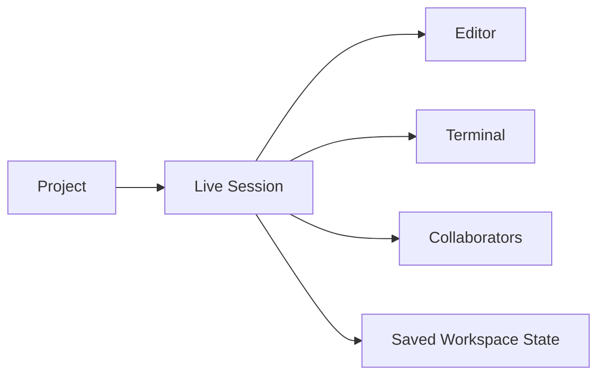

# Understanding the Workspace

The workspace is the live environment attached to your project. It is where files, terminal output, collaborator presence, and runtime state come together.

## Why the workspace matters

Many first-time users expect a project to behave like a static folder. In CodePark, the workspace is active:

- The editor reflects the current file state
- The terminal runs inside the project environment
- Collaboration happens in real time
- Session state is saved and restored when the workspace reconnects

## Main areas of the workspace

### File explorer

The file explorer shows the project tree. Use it to open files, create folders, rename items, and delete files you no longer need.

### Editor

The main editor uses Monaco and supports multi-cursor editing, selections, and language-aware formatting.

### Terminal

The terminal runs inside the project environment, so commands affect the same filesystem that the editor is showing.

### Right-side panels

The right side of the editor includes collaboration and workflow panels such as collaborators, chat, AI, and access requests.

## How state flows

When you edit a file, CodePark keeps the workspace synchronized so the rest of the session can see the change. When you leave and return, the workspace is restored from project data instead of starting from scratch.



## Working effectively

1. Keep the file explorer open while you learn the project structure.
2. Use the terminal for installs, tests, and local commands.
3. Watch collaborator presence when editing shared files.
4. Save time by opening only the files you are actively working in.

> [!TIP]
> Treat the workspace like a shared room. If you move a file, rename a directory, or run a long command, other collaborators see the effects in the same live session.

## Practical example

If you are working on a Node project, your first workspace pass might look like this:

```bash
npm install
npm run dev
```

Then in the editor:

- Open `src/index.ts`
- Watch the file tree update when you create a new route
- Check the chat panel if a teammate asks a question about the change

## Best practices

- Keep the workspace root clean.
- Use the terminal for work that belongs in the project, not in your browser.
- Close files you are not actively editing.
- Let the session restore finish before assuming the project is broken.

## Common mistakes

- Confusing the project record with the live session
- Looking for changes in the dashboard when they only exist in the editor session
- Running commands in the wrong terminal tab

## Troubleshooting

If the workspace opens but files look incomplete:

- Refresh the page once
- Wait for session restoration to finish
- Check whether you have access to the full project rather than a waiting-room view

If the terminal is disconnected, the session may still be reconnecting in the background.

## Next steps

- [Creating Your First Project](/docs/getting-started/creating-first-project)
- [Managing Projects](/docs/projects/managing-projects)
- [Inviting Teammates](/docs/collaboration/inviting-teammates)
